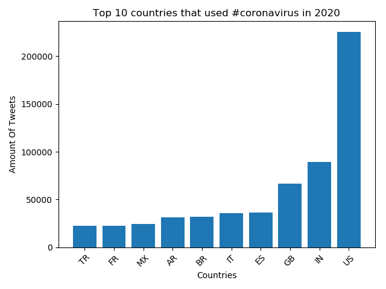
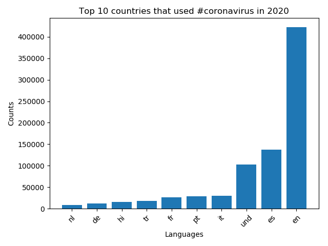
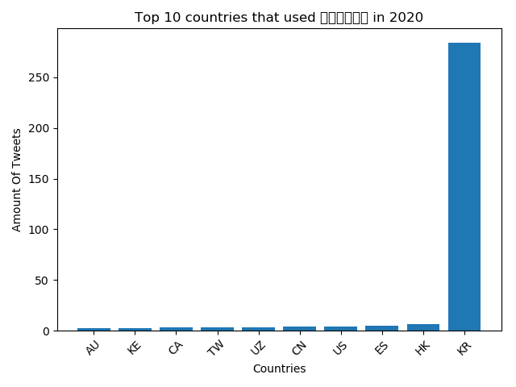
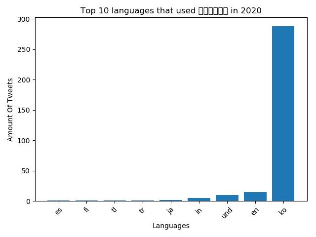

# Coronavirus twitter analysis

I scanned all geotagged tweets sent in 2020 to monitor for the spread of the coronavirus on social media, to learn how to: 
1. work with large scale datasets
1. work with multilingual text
1. use the MapReduce divide-and-conquer paradigm to create parallel code

## Background

**About the Data:**

Approximately 500 million tweets are sent everyday.
Of those tweets, about 2% are *geotagged*.
That is, the user's device includes location information about where the tweets were sent from.
The lambda server's `/data/Twitter dataset` folder contains all geotagged tweets that were sent in 2020.
In total, there are about 1.1 billion tweets in this dataset.

The tweets are stored as follows.
The tweets for each day are stored in a zip file `geoTwitterYY-MM-DD.zip`,
and inside this zip file are 24 text files, one for each hour of the day.
Each text file contains a single tweet per line in JSON format.
JSON is a popular format for storing data that is closely related to python dictionaries.

Vim is able to open compressed zip files,
For example, run the command
```
$ vim /data/Twitter\ dataset/geoTwitter20-01-01.zip
```
Or you can get a "pretty printed" interface with a command like
```
$ unzip -p /data/Twitter\ dataset/geoTwitter20-01-01.zip | head -n1 | python3 -m json.tool | vim -
```

**About MapReduce:**

I followed the [MapReduce](https://en.wikipedia.org/wiki/MapReduce) procedure to analyze these tweets.
MapReduce is a famous procedure for large scale parallel processing that is widely used in industry.
It is a 3 step procedure summarized in the following image:


The partition step was already done, so the tweets were seperated into one file per day).

**MapReduce Runtime:**

Let $n$ be the size of the dataset and $p$ be the number of processors used to do the computation.
The simplest and most common scenario is that the map procedure takes time $O(n)$ and the reduce procedure takes time $O(1)$.
(These will be the runtimes of our map/reduce procedures.)
In this case, the overall runtime is $O(n/p + \log p)$.
In the typical case when $p$ is much smaller than $n$,
then the runtime simplifies to $O(n/p)$.
This means that:
1. doubling the amount of data will cause the analysis to take twice as long;
1. doubling the number of processors will cause the analysis to take half as long;
1. if you want to add more data and keep the processing time the same, then you need to add a proportional number of processors.

It is currently not known which algorithms can be parallelized with MapReduce and which algorithms cannot be parallelized this way.
Most computer scientists believe there are some algorithms which cannot be parallelized,
but we don't yet have a proof that this is the case.


**Task 1: Map**

The `map.py` file processes the zip file for an individual day.
From the root directory of my clone, I can run the command
```
$ ./src/map.py --input_path=/data/Twitter\ dataset/geoTwitter20-02-16.zip
```
This command will take a few minutes to run as it is processing all of the tweets within the zip file.
After the command finishes, I had a folder `outputs` that contains a file `/geoTwitter20-02-16.zip.lang`.
This is a file that contains JSON formatted information summarizing the tweets from 16 February.

[Past lab experiences](https://github.com/mikeizbicki/lab-pipes-twitter/tree/38d6bf875e5cc0ee8ef8d6913bfff3702fffa79f) also helped me learn to navigate `unzip`, `grep`, and `jq`. 

**Task 1b: Visualize**

The `visualize.py` file displays the output from running the `map.py` file.
Run the command
```
$ ./src/visualize.py --input_path=outputs/geoTwitter20-02-16.zip.lang --key='#coronavirus'
```
This displays the total number of times the hashtag `#coronavirus` was used on 16 February in each of the languages supported by twitter.
Now I can manually inspect the output of the `.lang` file using vim:
```
$ vim outputs/geoTwitter20-02-16.zip.lang
```
This reveals that the file contains a dictionary of dictionaries.
The outermost dictionary has hashtags as the keys,
and the innermost dictionary has languages as the keys.
The `visualize.py` file simply provides a nicer visualization of these dictionaries.


**Task 2: Reduce**

The `reduce.py` file merges the outputs generated by the `map.py` file so that the combined files can be visualized.
I generated a new output file for a different day of data by running the command
```
$ ./src/map.py --input_path=/data/Twitter\ dataset/geoTwitter20-02-17.zip
```
This creates multiple days worth of data.
In order to visualize this data, I merged it into a single file, with the `reduce.py` command.
Merge the data files by running:
```
$ ./src/reduce.py --input_paths outputs/geoTwitter20-02-16.zip.lang outputs/geoTwitter20-02-17.zip.lang --output_path=reduced.lang
```
Alternatively, I can use the glob to merge all output files with the command
```
$ ./src/reduce.py --input_paths outputs/geoTwitter*.lang --output_path=reduced.lang
```

**Task 2b: Visualize**

The format of the data files that `reduce.py` outputs is the same format as the data files that `map.py` outputs.
Therefore, I can use the same visualization code on both of them.
Now I can visualize the `reduced.lang` file with the command
```
$ ./src/visualize.py --input_path=reduced.lang --key='#coronavirus'
```
and this displays the combined result.

## Programming Tasks

I completed the following tasks:

**Task 0: Create the mapper**

I Modified the `map.py` file so that it tracks the usage of the hashtags on both a language and country level.
This will require creating a variable `counter_country` similar to the variable `counter_lang`, 
and modifying this variable in the `#search hashtags` section of the code appropriately.
The output of running `map.py` should be two files now, one that ends in `.lang` for the language dictionary (same as before),
and one that ends in `.country` for the country dictionary.

> Most tweets contain a `place` key,
> which contains a dictionary with the `country_code` key.
> This is how I was able to lookup the country that a tweet was sent from.
> Some tweets, however, do not have a `country_code` key.
> This can happen, for example, if the tweet was sent from international waters or the [international space station](https://web.archive.org/web/20220124224726/https://unistellaroptics.com/10-years-ago-today-the-first-tweet-was-sent-directly-from-space/).

**Task 1: Run the mapper**

> I thoroughly tested my `map.py` file on a single day's worth of tweets and verify that I was getting reasonable results before moving on to this step.

I then created a shell script called `run_maps.sh`.
This file will loop over each file in the dataset and run the `map.py` command on that file.
Each call to `map.py` can take up to a day to finish, so I used the `nohup` command to ensure the program continues to run after I disconnect and the `&` operator to ensure that all `map.py` commands run in parallel.

> I used the glob `*` to select only the tweets from 2020 and not all tweets.

**Task 2: Reduce**


After my modified `map.py` had run on all the files,
I had a large number of files in my `outputs` folder.
I then used the `reduce.py` file to combine all of the `.lang` files into a single file,
and all of the `.country` files into a different file.

**Task 3: Visualize**

Initially, I was visualizing my output files with the command
```
$ ./src/visualize.py --input_path=PATH --key=HASHTAG
```
This prints the top keys to stdout.

I modified the `visualize.py` file so that it generates a bar graph of the results and stores the bar graph as a png file. The graphs are created with matplotlib. 
The horizontal axis of the graph shows the keys of the input file,
and the vertical axis of the graph shows the values of the input file.
The final results are the top 10 keys, sorted from low to high.

I ran the `visualize.py` file with the `--input_path` equal to both the country and lang files created in the reduce phase, and the `--key` set to `#coronavirus` and `#코로나바이러스`.
This generated four plots in total, see below! 

Top 10 countries that used #coronavirus in 2020


Top 10 languages that used #coronavirus in 2020


Top 10 countries that used #코로나바이러스 in 2020


Top 10 languages that used #코로나바이러스 in 2020


**Task 4: Alternative Reduce**

I also created a new file `alternative_reduce.py`.
This file take as input - the command line a list of hashtags,
and output - a line plot where:
1. There is one line per input hashtag.
1. The x-axis is the day of the year.
1. The y-axis is the number of tweets that use that hashtag during the year.

My`alternative_reduce.py` file follows a similar structure to a combined version of the `reduce.py` and `visualize.py` files.
I scanned through all of the data in the `outputs` folder created by the mapping step.
In this scan, the code was able to construct a dataset that contains the information needed for the plot. 

See all graphs below: 


Done!
