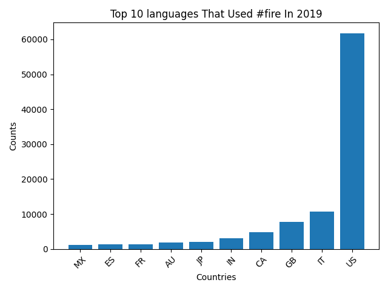
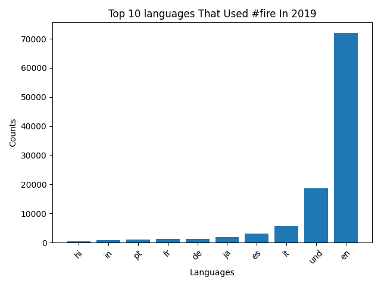
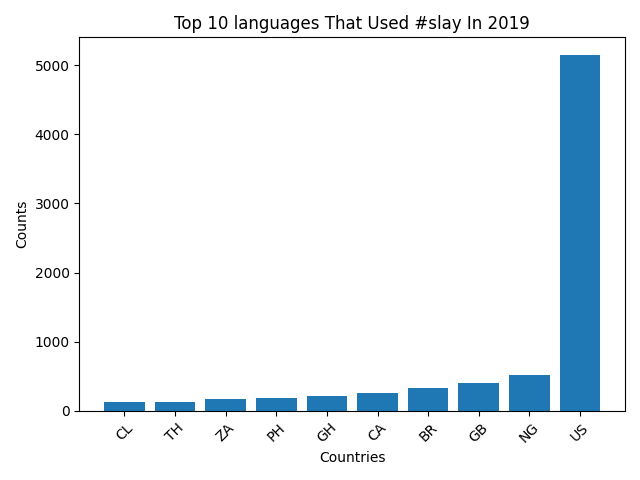
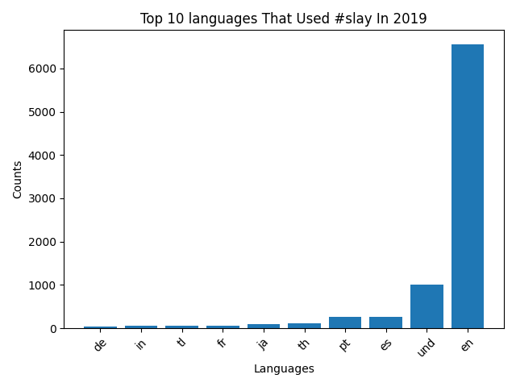
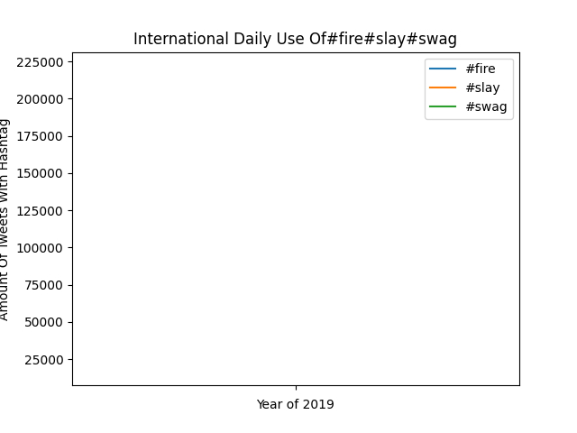

# What were we saying in 2019? 

I scanned all geotagged tweets sent in 2019 to analyze the popularity of hashtags with different slang terms that I used when I was in highschool in 2019. In this project, I: 
1. work with large scale datasets
1. use the MapReduce divide-and-conquer paradigm to create parallel code
1. contribute to the zeitgest


## Background

**About the Data:**

Approximately 500 million tweets are sent everyday. Of those tweets, about 2% are *geotagged*. That is, the user's device includes location information in the tweets about where the tweets were sent from. The dataset this program worked with contains all geotagged tweets from 2018 - 2021. In total, there are about 1.1 billion tweets in this dataset.

I'll be analyzing the chosen hashtags - #swag, #slay, #fire, #cheugy. 

**Goals**

We aim to create two bar graphs documenting the top 10 countries and languages respectively to use one hashtag. 

We also want to a line graph with one line per hashtag, an x-axis with days of the year, and a y-axis with the number of tweets to see how the popularity of these different hashtags changed over the year and compare them to other hashtags. 

## Task 0: Creating a mapper  

We will create a `map.py` program that goes through a day of tweets and collects the required information for the list of hashtags we are interested in. 

Let's first see how we can load the data for just one of these 365 zipfiles in the year. Recall that one of these zipfiles contains a day worth of tweets. Let's see whether there is internal structure to this zipfile:

```
$ unzip -l /data/Twitter\ dataset/geoTwitter20-01-01.zip
Archive:  /data/Twitter dataset/geoTwitter20-01-01.zip
  Length      Date    Time    Name
---------  ---------- -----   ----
643841004  2019-12-31 18:05   geoTwitter20-01-01/geoTwitter20-01-01_00:00
631768699  2019-12-31 19:05   geoTwitter20-01-01/geoTwitter20-01-01_01:00
621817941  2019-12-31 18:57   geoTwitter20-01-01/geoTwitter20-01-01_02:00
628146105  2019-12-31 21:05   geoTwitter20-01-01/geoTwitter20-01-01_03:00
622128450  2019-12-31 22:05   geoTwitter20-01-01/geoTwitter20-01-01_04:00
614871172  2019-12-31 23:05   geoTwitter20-01-01/geoTwitter20-01-01_05:00
580720014  2020-01-01 00:05   geoTwitter20-01-01/geoTwitter20-01-01_06:00
527548129  2020-01-01 01:05   geoTwitter20-01-01/geoTwitter20-01-01_07:00
501700915  2020-01-01 02:05   geoTwitter20-01-01/geoTwitter20-01-01_08:00
476295815  2020-01-01 03:05   geoTwitter20-01-01/geoTwitter20-01-01_09:00
486557273  2020-01-01 02:57   geoTwitter20-01-01/geoTwitter20-01-01_10:00
510818702  2020-01-01 05:05   geoTwitter20-01-01/geoTwitter20-01-01_11:00
556444907  2020-01-01 06:05   geoTwitter20-01-01/geoTwitter20-01-01_12:00
598075378  2020-01-01 07:05   geoTwitter20-01-01/geoTwitter20-01-01_13:00
636388154  2020-01-01 06:57   geoTwitter20-01-01/geoTwitter20-01-01_14:00
651027058  2020-01-01 09:05   geoTwitter20-01-01/geoTwitter20-01-01_15:00
657123763  2020-01-01 10:05   geoTwitter20-01-01/geoTwitter20-01-01_16:00
655680912  2020-01-01 09:57   geoTwitter20-01-01/geoTwitter20-01-01_17:00
648024192  2020-01-01 12:05   geoTwitter20-01-01/geoTwitter20-01-01_18:00
643115421  2020-01-01 13:05   geoTwitter20-01-01/geoTwitter20-01-01_19:00
636550818  2020-01-01 12:57   geoTwitter20-01-01/geoTwitter20-01-01_20:00
644117632  2020-01-01 13:57   geoTwitter20-01-01/geoTwitter20-01-01_21:00
636132908  2020-01-01 16:00   geoTwitter20-01-01/geoTwitter20-01-01_22:00
626319988  2020-01-01 15:57   geoTwitter20-01-01/geoTwitter20-01-01_23:00
---------                     -------
14435215350                     24 files
```

We see that the zipfiles contain 24 .txt files inside - each .txt files contains an hour worth of tweets. Each line in a single .txt files contains exactly one tweet. We can see one of these tweets with

```
$ unzip -p /data/Twitter\ dataset/geoTwitter20-01-01.zip | head -n1 | python3 -m json.tool | vim -
```

which will open a vim file that shows one tweet. It's important to see how a tweet is stored so that we can correctly extract the country and language information. From this, we will be able to see how we access country and language information.

Since we are configuring `map.py` to process a single day's worth of tweets, we will eventually call `map.py` around 365 times - each time with a different zip file for a different day. Let us prepare it to take a zipfile as an input and put its output in a different folder with: 

```
import argparse
parser = argparse.ArgumentParser()

# input_path = zip file (contains many txt files)  we want to run this on 
parser.add_argument('--input_path',required=True)

# if not specified, this will add to the outputs folder
# within the twitter_coronavirus folder
parser.add_argument('--output_folder',default='outputs')
args = parser.parse_args()
```

Since we are interested in plotting the amount of times a country has used a hashtag and the amount of languages of a tweet that have used that hashtag, we will create a list of the hashtags we are interested in and two different counters: 

```
# load keywords
hashtags = ['#swag','#slay', '#cheugy' '#fire']

# initialize counters
counter_lang = defaultdict(lambda: Counter()) #MAKE LANG DICT
counter_country = defaultdict(lambda: Counter()) #MAKE COUNTRY DICT
```

Now, lets fill those up! We want the counter dictionaries to have this structure: 


```
{
  "_all": { 
      "US": 20662310,   # Total tweets from the US
      "GB": 3754127,    # Total tweets from the UK
      "JP": 4606864,    # Total tweets from Japan
  },
  "#slay": {
      "GB": 603,  # Tweets mentioning "#slay" from the UK
      "US": 66,   # Tweets mentioning "slay" from the US
  },
  "#cheugy": {
      "US": 24,   # Tweets mentioning "#cheugy" from the US
      "JP": 2,    # Tweets mentioning "#cheugy" from Japan
  }
}

```
The outermost dictionary has hashtags as the keys,
and the innermost dictionary has countries as the keys.
The langauge dictionary is the exact same, except that the innermost dictionary has languages as the keys instead. 

Let us start building these counters! We will open up the zipfile, the txt file, and load the tweet with json formatting, and start building these counters: 

```
# open the zipfile - one day!
with zipfile.ZipFile(args.input_path) as archive:

    # loop over every txt file within the zip file - each one hour!
    for i,filename in enumerate(archive.namelist()):

        print(datetime.datetime.now(),args.input_path,filename)

        # open the inner file - one hour! 
        with archive.open(filename) as f:

            # loop over each line in this file - one tweet!
            for line in f:

                # load the tweet as a python dictionary (MAKE TWEET DICT) 
                tweet = json.loads(line)

                # convert text to lower case
                text = tweet['text'].lower()

                # search hashtags
                # referring to the list encoded above in this file
                for hashtag in hashtags:

                    # referring to the dictionary we made (USE TWEET DICT) 
                    lang = tweet['lang']
                    try:
                        country = tweet['place']['country_code']
                    except:
                        country = 'unspecified'

                    if hashtag in text:
                        counter_lang[hashtag][lang] += 1 #ADD TO LANG DICT
                        counter_country[hashtag][country] +=1

                    counter_lang['_all'][lang] += 1
                    counter_country['_all'][country] += 1
```

Now the counters have been built! Finally, we just need to dump the two counters we've created into their corresponding files so that we can access it later in the reduce step. 

```
try:
    #make outputs folder
    os.makedirs(args.output_folder)
except FileExistsError:
    pass

#making the path - outputs/___input_base__ (name of zip folder we specified in terminal) 
output_path_base = os.path.join(args.output_folder,os.path.basename(args.input_path))

#adding the .lang to the name to show that we're counting the langauges 
output_path_lang = output_path_base+'.lang'

output_path_country = output_path_base+'.country'

#now that it has a path and name, we can open it as a file and write to it
with open(output_path_lang,'w') as f:
    #and we'll dump the counter_lang dict we made in json format!! done! yay!!
    f.write(json.dumps(counter_lang))

print('saving',output_path_country)
with open(output_path_country,'w') as f:
    f.write(json.dumps(counter_country))
```

The `outputs` folder will now contain two files corresponding to the country and language data we wanted, for each day that our `map.py` file processed. And that wraps up our `map.py`! Let us run it on a single zipfile and see what it does 

```
$ ls
README.md  run_maps.sh  src
$ python3 src/map.py --input_path="/data/Twitter dataset/geoTwitter20-01-01.zip" 
2025-02-20 13:59:44.068088 /data/Twitter dataset/geoTwitter20-01-01.zip geoTwitter20-01-01/geoTwitter20-01-01_00:00
2025-02-20 14:00:16.463198 /data/Twitter dataset/geoTwitter20-01-01.zip geoTwitter20-01-01/geoTwitter20-01-01_01:00
2025-02-20 14:00:47.481073 /data/Twitter dataset/geoTwitter20-01-01.zip geoTwitter20-01-01/geoTwitter20-01-01_02:00
2025-02-20 14:01:19.223782 /data/Twitter dataset/geoTwitter20-01-01.zip geoTwitter20-01-01/geoTwitter20-01-01_03:00
```

Amazing, it is processing one .txt file at a time. Notice that before this call to `map.py`, we have no `outputs` folder. Also notice that `map.py` is taking about a minute to go through one .txt file - this speed is dependent on how many others are on the server. 

For debugging purposes, I found this command useful to run in a second terminal to see that it is in fact running: 
```
$ ps -u $(whoami) | grep python
3788558 pts/154  00:04:10 python3
```
If you press `^C` on your first terminal running `map.py`, then you should see no output after running the `$ ps -u $(whoami) | grep python` command again on the second terminal. Do not run `ps` only, since this will only capture processes being run in that specific terminal session, not all terminal sessions that you may have open. 

When this single call to `map.py` finishes, we should see a new `outputs` folder, and it should have two files inside of it - `/data/Twitter dataset/geoTwitter20-01-01.zip.lang` and `/data/Twitter dataset/geoTwitter20-01-01.zip.country`. We see

```
$ python3 src/map.py --input_path="/data/Twitter dataset/geoTwitter20-01-01.zip"

2025-02-20 13:59:44.068088 /data/Twitter dataset/geoTwitter20-01-01.zip geoTwitter20-01-01/geoTwitter20-01-01_00:00
.
.
.
2025-02-20 14:11:05.051303 /data/Twitter dataset/geoTwitter20-01-01.zip geoTwitter20-01-01/geoTwitter20-01-01_23:00
saving outputs/geoTwitter20-01-01.zip.country
$ ls
outputs  README.md  run_maps.sh  src
$ cd outputs/
$ ls
geoTwitter20-01-01.zip.country  geoTwitter20-01-01.zip.lang
$ 
```

Yay! Open these files and confirm the counters are being built correctly. The outermost dictionary should have as many keys as the number of hashtags + 1. After you have confirmed that this is working, go ahead and delete this `outputs` folder since we will re-do this work in Task 1. 

# Task 1: Running the mapper 

Our `map.py` file only runs on one day worth of tweets at time. We want to feed it all 365 zip files in the year 2019. Thus, we create a `run_map.sh` file that will feed in those zipfiles. The `run_map.sh` is very simple: 

```
#map.py works on a single zip file = 1 day 
#this script will feed in all the zip files from 2019 to map.py 

for file in /data/Twitter\ dataset/geoTwitter19*.zip; do
    ./src/map.py --input_path="$file" &
done 
```

Let us see what happens if we run this script:

```
$ sh run_maps.sh 
2025-02-20 14:25:26.255138 /data/Twitter dataset/geoTwitter19-04-05.zip geoTwitter19-04-05/geoTwitter19-04-05_00:00
2025-02-20 14:25:26.332121 /data/Twitter dataset/geoTwitter19-01-02.zip geoTwitter19-01-02/geoTwitter19-01-02_00:00
2025-02-20 14:25:26.334264 /data/Twitter dataset/geoTwitter19-01-05.zip geoTwitter19-01-05/geoTwitter19-01-05_00:00
2025-02-20 14:25:26.427115 /data/Twitter dataset/geoTwitter19-05-25.zip geoTwitter19-05-25/geoTwitter19-05-25_00:00
2025-02-20 14:25:26.459719 /data/Twitter dataset/geoTwitter19-01-04.zip geoTwitter19-01-04/geoTwitter19-01-04_00:00
2025-02-20 14:25:26.470121 /data/Twitter dataset/geoTwitter19-01-03.zip geoTwitter19-01-03/geoTwitter1
```

We see that multiple zip files are being opened simultaneously, and not necessarily in consecutive order of the days. This is because QQ (what is mapreduce alg actually doing?). 

The script finishes its run immediately, and opens up as many python runs as needed to go through the days in 2019 - which seems to be 356 in this database. 

```
$ ps | grep python | wc -l
356
$ ls /data/Twitter\ dataset/geoTwitter19*.zip | wc -l
356
```

Once we see this, we simply need to let it run! 

To check that `nohup` actually worked in making sure that your python processes are still running after you logout of the lamdba server, go ahead and `$ exit`, log back in, and use: 

```
$ ps aux | grep atiwari | grep python  
atiwari+ 1616232  2.4  0.0  21672 13440 ?        R    19:11   1:57 python ./src/map.py --input_path=/data/Twitter dataset/geoTwitter19-01-01.zip
atiwari+ 1616233  2.6  0.0  21660 13440 ?        R    19:11   2:06 python ./src/map.py --input_path=/data/Twitter dataset/geoTwitter19-01-02.zip
atiwari+ 1616234  2.0  0.0  21684 13440 ?        R    19:11   1:38 python ./src/map.py --input_path=/data/Twitter dataset/geoTwitter19-01-03.zip
```

and  you'll see that all of the pyhton processes are still running! 

If at any point you want to quit the entire run, you will need to kill all of the python processes, you can do so with: 
```
$ pkill -u $(whoami) -f python
```

# Task 2: Reduce

The `reduce.py` file merges the outputs generated by the `map.py` file so that the combined files can be visualized.

In order to visualize this data, I used `reduce.py` twice with these commands: 
```
$ ./src/reduce.py --input_paths outputs/geoTwitter*.lang --output_path=reduced.lang
```
and
```
$ ./src/reduce.py --input_paths outputs/geoTwitter*.country --output_path=reduced.country
```

## Task 3: Visualize 

I modified the `visualize.py` file so that it generates a bar graph of the results and stores the bar graph as a png file. The graphs are created with matplotlib. 
The horizontal axis of the graph shows the keys of the input file,
and the vertical axis of the graph shows the values of the input file.
The final results are the top 10 keys, sorted from low to high.

I ran the `visualize.py` file with the `--input_path` equal to both the country and lang files created in the reduce phase, and the `--key` set to `#slay` and `cheugy`.
```
$ ./src/visualize.py --input_path=reduced.lang --key='#cheugy'
```
 This generated four plots in total, see below! 

Top 10 countries that used #fire in 2019



Top 10 languages that used #fire in 2019



Top 10 countries that used #slay in 2019



Top 10 languages that used #slay in 2019




# Task 4: Alternative Reduce

I also created a new file `alternative_reduce.py`, which is a combined version of the `reduce.py` and `visualize.py` files to create a line graph instead of a bar graph with 
```
python3 src/alt_reduce_visual.py --input_paths reduced.country reduced.lang --keys '#fire' '#slay' '#swag'
```
International Daily Use of #fire #swag #slay in 2019:



**About MapReduce:**

I followed the [MapReduce](https://en.wikipedia.org/wiki/MapReduce) procedure to analyze these tweets.
MapReduce is a famous procedure for large scale parallel processing that is widely used in industry.
It is a 3 step procedure summarized in the following image:


This post will not go over the partition step, which seperated the tweets into a file per day. 

**MapReduce Runtime:**

Let $n$ be the size of the dataset and $p$ be the number of processors used to do the computation.
The simplest and most common scenario is that the map procedure takes time $O(n)$ and the reduce procedure takes time $O(1)$.
(These will be the runtimes of our map/reduce procedures.)
In this case, the overall runtime is $O(n/p + \log p)$.
In the typical case when $p$ is much smaller than $n$,
then the runtime simplifies to $O(n/p)$.
This means that:
1. doubling the amount of data will cause the analysis to take twice as long;
1. doubling the number of processors will cause the analysis to take half as long;
1. if you want to add more data and keep the processing time the same, then you need to add a proportional number of processors.

It is currently not known which algorithms can be parallelized with MapReduce and which algorithms cannot be parallelized this way.
Most computer scientists believe there are some algorithms which cannot be parallelized,
but we don't yet have a proof that this is the case.


